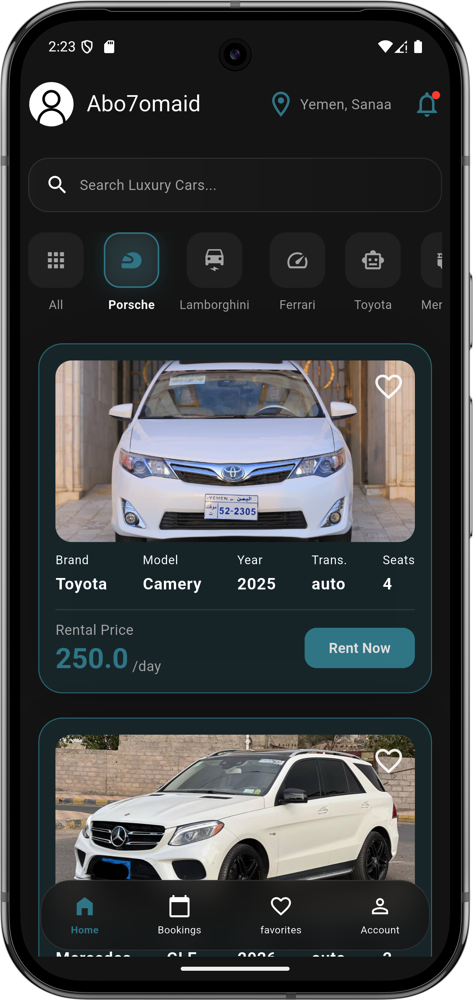
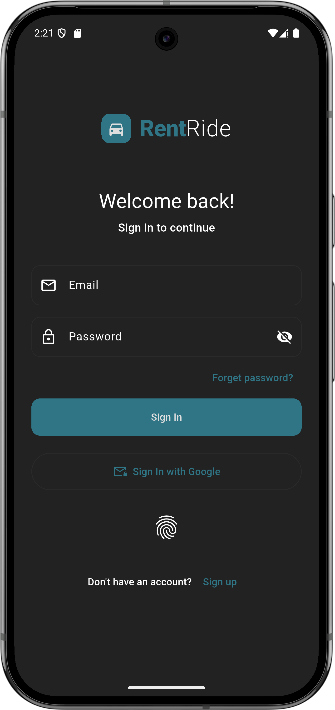
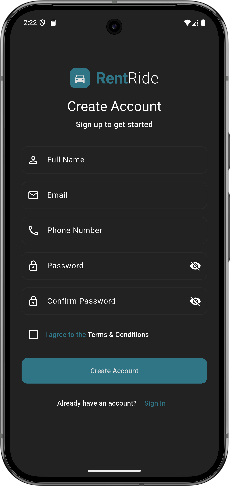
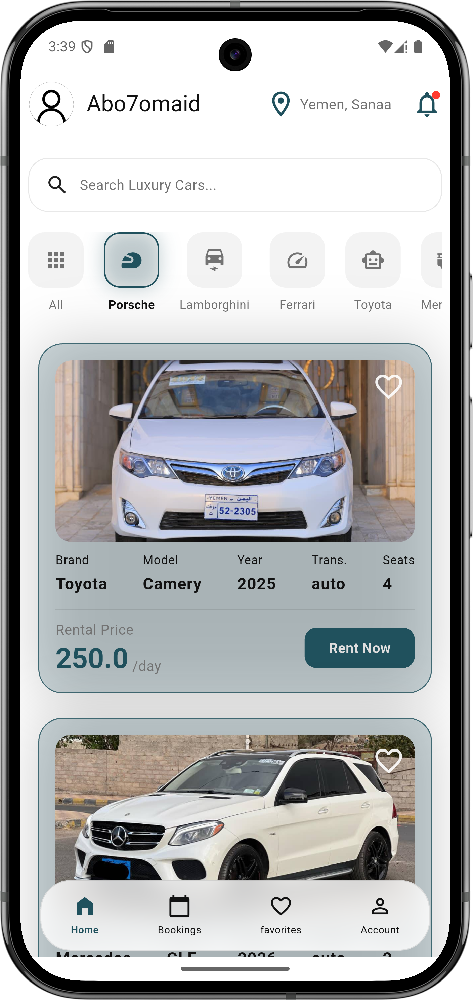

<div >
  
  # 🚗 RentRide
  
  **A Premium, Secure, and Feature-Rich Car Rental Application**
  
  
  
  
  
</div>

<br>

RentRide is a modern, cross-platform mobile application designed to make renting luxury cars seamless, secure, and fast. Built as a comprehensive final year project, it showcases advanced Flutter architecture, real-time backend integration, and a focus on premium UI/UX.

---

## 📸 Screenshots
*--*

<p align="center">
  
  
  
  
</p>
---

## ✨~~~~ Key Features

*   **Advanced Authentication:** Secure login using Email/Password, Google Sign-In (OAuth 2.0), and Hardware Biometrics (Fingerprint/FaceID).
*   **Live Car Catalog:** Browse luxury cars dynamically fetched from the cloud. Filter by brand (Porsche, Mercedes, Ferrari, etc.) and view detailed specifications.
*   **Seamless Booking Engine:** Select rental dates via an intuitive calendar picker, automatically calculate pricing, and confirm rentals with a double-confirmation flow.
*   **Favorites & Wishlist:** Save favorite cars locally with offline support powered by Hive.
*   **Real-Time Push Notifications:** Receive instant system-level alerts the moment a booking is successfully confirmed.
*   **Booking History:** Track past, active, and upcoming rentals with custom status badges.
*   **Premium UI/UX:** A bespoke dark-mode luxury aesthetic featuring glassmorphism, Shimmer loading skeletons, and fluid Lottie animations.

---

## 🛠️ Tech Stack

### **Frontend (Mobile App)**
*   **Framework:** [Flutter](https://flutter.dev/) (Dart)
*   **UI Components:** Custom Glassmorphism, Shimmer, Lottie
*   **State & Navigation:** Provider / Stateful logic, Named Routes

### **Backend & Database**
*   **Platform:** [Supabase](https://supabase.com/)
*   **Database:** PostgreSQL
*   **Security:** Row Level Security (RLS), JWT Authentication

### **Local Storage & Hardware Integration**
*   **Offline Storage:** [Hive](https://pub.dev/packages/hive) (NoSQL DB)
*   **Secure Caching:** Flutter Secure Storage (AES-256 Encryption)
*   **Hardware:** Local Auth (Biometrics), Permission Handler

---

## 🔒 Security Architecture
RentRide prioritizes user data protection:
1.  **Row Level Security (RLS):** Enforced at the PostgreSQL level. Users can only read/write their own booking and profile data.
2.  **Encrypted Sessions:** Session tokens are stored using Android Keystore and iOS Keychain.
3.  **Just-In-Time Permissions:** The app only requests location and notification permissions at the exact moment they are required, maximizing privacy.

---

## 🚀 Getting Started

### Prerequisites
*   Flutter SDK (`^3.12.2` or later)
*   Android Studio / VS Code
*   A Supabase account and project

### Installation

1. **Clone the repository:**
   ```bash
   git clone https://github.com/YOUR_USERNAME/rentride.git
   cd rentride
   ```

2. **Install dependencies:**
   ```bash
   flutter pub get
   ```

3. **Configure Environment Variables:**
   * Open `lib/core/constants/app_config.dart` (or your Supabase config file).
   * Insert your Supabase URL and Anon Key.
   * *Note: Never commit your actual API keys to a public GitHub repository!*

4. **Run the app:**
   ```bash
   flutter run
   ```

---

## 📁 Project Structure (lib/)

```text
lib/
├── core/
│   ├── constants/    # Theme, Colors, API Keys
│   └── route/        # App Navigation
├── data/
│   ├── models/       # UserModel, CarModel, BookingModel
│   └── services/     # Supabase, Auth, Hive, Notifications
├── features/
│   ├── auth/         # Login & Registration Screens
│   ├── home/         # Car Catalog & Search
│   ├── bookings/     # Rental History
│   ├── profile/      # User Account
│   └── splash/       # Splash & Onboarding
├── my_widgets/       # Reusable UI (Buttons, TextFields, Cards)
└── main.dart         # App Entry Point
```

---

<div >
  <b>Built with ❤️ by Abo7omaid for Final Year Computer Science Project</b>
</div>
